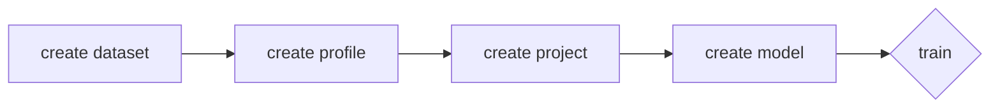

# What is SimpleClai?

SimpleCommandLineAI, SimpleClai or sclai for short aims to automate the machine learning workflow. This is the command line version of SimpleAi (comming soon). Currently it is focused on easy setup of the [TensorFlow Object Detection API](https://github.com/tensorflow/models/tree/master/research/object_detection#tensorflow-object-detection-api) and training of its models respectively.
> **Note:** SimpleClai currently only supports debain based linux distributions.

> **Furthermore:** SimpleClai is still not finished and currently not working.

# Installation
**Download** the .deb file from the latest release in the [releases](https://github.com/sertschgi/simpleClai/releases) page. 

- Option 1: 
	1. **Click** on the downloaded file. 
	2. **Open** with your installation App. *(Software Center in Ubuntu)*
	3. **Click** *install*.

- Option 2: 
	1. **Open** a terminal.
	2. `cd Downloads`
	3. `sudo dpkg -i sclai.deb`

# Usage
> **Note:** You might want to read [Workflow](#Workflow) first.

    sclai [options] command

Always available **options** are:
| | |
|--|--|
| `-h`, `--help` | `Displays help on commandline options.` |
| `-v`, `--version` | `Displays version information.` |

## Commands

### - create
    sclai create [options] command

> **Note:** All data created by the user is usually saved in `~/.sclai`.  [More](#DataSaving#Paths) about saved data.

#### Available commands are:
***
#### - dataset

    sclai create dataset [options]

Available **options** are:
| | | |
|--|--|--|
| `-n`, `--name` | `Specify the name of your dataset.` | *required* |
| `-l`, `--labels` | `Specify the path of your labelmap.pbtxt` | *required* |
| `-a`, `--labels_path` | `Specify the label path` | *required* |
| `-m`, `--images_path` | `Specify the images path` | *required* |

Example:

    sclai create dataset -n mydataset -l path/to/my/labelmap.pbtxt -a path/to/my/labels -m path/to/my/images 

> **Note:** Supported label formats: xml, csv. Xml files need to be provided for each image with the same name. When using a csv file only one file is supported. [More](#Labeling#Formats) about labeling.

***
#### - profile

    sclai create profile [options]
 
Available **options** are:
| | | |
|--|--|--|
| `-n`, `--name` | `Specify the name of your profile.` | *required* |
| `-f`, `--framework` | `Specify the framework you want to use.` | *required* |
| `-s`, `--scope` | `Specify which field of machine learning you want to use.` | *required* |

Example:

    sclai create profile -n myprofile -f tensorflow -s object_detection 

> **Note:** *Framework* and *scope* are usually defined in `/etc/sclai/config/frameworks.json`. This file contains all setup information. You can also [add your own custom framework](#CustomFrameworks) or adjust the existing.

***
#### - project

    sclai create project [options]
 
Available **options** are:

| | | |
|--|--|--|
| `-n`, `--name` | `Specify the name of your project.` | *required* |
| `-p`, `--profile` | `Specify the profile you want to use.` | *required* |
| `-d`, `--dataset` | `Specify the dataset you want to use.` | *required* |

Example:

    sclai create project -n myproject -p myprofile -d mydataset

***
#### - model

    sclai create model [options]
 
Available **options** are:
| | | |
|--|--|--|
| `-n`, `--name` | `Specify the name of your model.` | *required* |
| `-p`, `--project` | `Specify the project you want to use.` | *required* |
| `-m`, `--model` | `Specify the model you want to use.` | *required* |

Example:

    sclai create model -n mymodel -p myproject -m "CenterNet MobileNetV2 FPN"

***
### - train
    sclai train [options]
Available **options** are:
| | | |
|--|--|--|
| `-m`, `--model`  | `Specify the name of the model.` | *required* |
| `-p`, `--project` | `Specify the project.` | *required* |

Example:

    sclai train -p myproject -m mymodel

***
### - list
    sclai train [options]
Available **options** are:
| | | |
|--|--|--|
| `-d`, `--datasets` | `List the datasets.` |
| `-r`, `--profiles` | `List the profiles.` |
| `-p`, `--projects` | `List the projects.` | *default* |
| `-f`, `--frameworks` | `List the frameworks.` |

Example:

    sclai train -p myproject -m mymodel

# Workflow

A typical workflow could look like this:

**First** create a **dataset** from your labeled data. **Then** create a **profile**. This will install all apps needed for your training and set up a [conda](https://docs.conda.io/en/latest/) virtual environment to not interfere with your system. Both dataset and profile can of course be used for multiple projects. The **third** step is to create a **project** that contains your models. Now you can choose your **model** you want to use. There can also be multiple of the same type of model. **Finally** you can select a model and start **training**!

# Intern
## Data Saving
The grid lists all the default paths:
| | Path | Note |
| - | - | - |
| **app**: |
| exec |  `/usr/bin/sclai` 
| apps | `~/.sclai/profiles/apps` | *user specific*
|**config**: |
| frameworks | `/etc/sclai/config/frameworks.json`
| data | `~/.sclai/config/` | *user specific*, *changeable*
| datasets | `~/.sclai/config/datasets.json` | *user specific*
| profiles | `~/.sclai/config/profiles.json` | *user specific*
| projects | `~/.sclai/config/projects.json` | *user specific*
| **data**: |
| datasets | `~/.sclai/datasets` | *user specific*, *changeable*
| profiles | `~/.sclai/profiles` | *user specific*, *changeable*
| projects | `~/.sclai/profiles/projects` | *user specific*
| models | `~/.sclai/profiles/projects/models` | *user specific*

> **Note**: The model configuration is saved in `profiles.json`

The **data**-config, **datasets** and **profiles** path are **changeable**. To change them just **set** the environment variables in your `~/bashrc` and `~/bash_profile` respectively. 

Environment variables:
| | | 
| - | - | 
| data | `$DATA_CONFIG_PATH` 
| datasets | `$DATASET_PATH`
| profiles | `$PROFILE_PATH` 

Example:

    echo "export PROFILE_PATH=/path/to/profiles" >> ~/.bashrc

